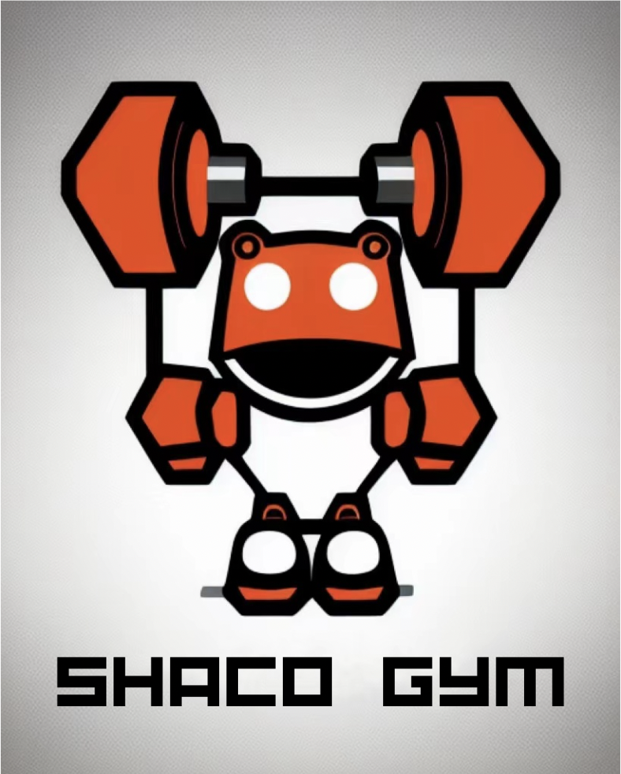

<div align="center">
  </img>
  <p><strong>Next Generation Competitive Programming</strong></p>

[English](README.md) | [简体中文](README_ZH-CN.md)

[](https://www.python.org/downloads/release/python-3109/)
[](https://github.com/PurePassersBy/ShacoGym)
[](https://github.com/PurePassersBy/ShacoGym)
[](https://github.com/PurePassersBy/ShacoGym/actions/workflows/flake8_lint.yml)
</div>


ShacoGym aims to explore a novel mechanism for next generation competitive programming. Traditional competitive programming, such as [codeforces](https://codeforces.com/) and [atcoder](https://atcoder.jp/), requires players to use optimized algorithm to solve deterministic problems. ShacoGym distinguish itself by aiming to solve a novel kind of problem including these features:
- :rainbow: **Interactive**
    - Each problem is a simulated environment, you are to implement an agent to interact with it and get higher rewards.
    - You do not have full information to solve problems, you need explore to get more information and you receive different information upon your different actions.
- :zap: **Non-deterministic**
    - There is no deterministic answer for problems (no AC nor WA!), just maximize your rewards.
- :fire: **Non-optimized**
    - There is maybe no optimized solution (only god knows!).


## Get Started

```bash
conda create -n shacogym python=3.10
conda activate shacogym
pip install -r requirements.txt
```

## Solve the Problem

Here is a baseline method for *Bandit*. Read [this](gym/problems/bandit/bandit.md) to learn this problem.

```bash
python entry.py --problem_name bandit --solution_file ./gym/problems/bandit/baseline.py
```

You can copy the `baseline.py` and improve it to gain higher score.
Make sure you implement the required funtions as the baseline. Have a fun!

## Play the game

You can play the problem as a game. Take [Tic-Tac-Toe](gym/problems/tictactoe/tictactoe.md) as your first journey in ShacoGym! 

```bash
python entry.py --mode play --problem_name tictactoe
```

## Solution Protocal

Here are some protocals we should follow:
1. Do not install libraries other than those in `requirements.txt`.
2. Do not do some hack to the code.
3. Do not see the source code of problems themselves.
